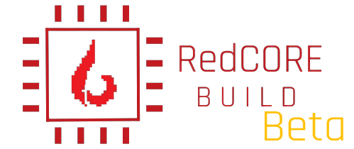
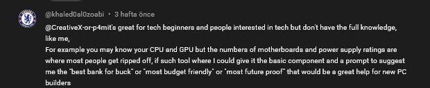

  

<h1 align="center">RedCore AI PC Builder</h1>

<i>Describe a PC in plain English. Get a compatible build.</i>

---

🔗 Demo Video: https://www.youtube.com/watch?v=nRa5SJxBWAM  
📄 System Workflow: see images below  
🧠 Status: Core engine complete - expanding compatibility system and UI

---

RedCore is a student-built web tool that helps beginners design a compatible desktop PC using natural language.

Example input:
> "I want a gaming PC around $800 for school and esports."

The system:
1. Uses an AI model to understand the request (budget, purpose, performance tier)
2. Applies real PC-building logic (budget allocation and compatibility rules)
3. Selects appropriate hardware parts from a database
4. Returns a complete PC build with explanations

**Important:** 

**The AI does not directly choose components.**
It only extracts the user's intent. All hardware decisions are made by a rule-based backend configuration engine.

---

## Demo Video

▶ Watch the demo: https://www.youtube.com/watch?v=nRa5SJxBWAM

## Design Concept

<table>
<tr>
<td></td>
<td></td>
</tr>
<tr>
<td></td>
<td></td>
</tr>
</table>

## System Workflow

---

### What Problem It Solves

Many beginners want a PC but are afraid of:
- incompatible parts
- wasting money on unbalanced builds
- not understanding technical specifications

RedCore aims to act like a knowledgeable friend who plans a balanced build automatically.

---

### Real User Feedback

Before building RedCore, I shared the idea online to see if the problem actually exists.

These are real responses from PC users and beginners explaining their difficulties when choosing parts and compatibility.

They confirm that many people understand CPUs and GPUs, but struggle with:

- motherboard compatibility
- PSU wattage
- trusting their own build choices
- fear of damaging expensive hardware

This project was created specifically to address those concerns.

*(The following comments were posted by independent users after I shared the early concept of the tool online. They were not 
asked to promote the project they were reacting to the idea itself.)*

These responses showed that the biggest barrier for beginners is confidence, not price.
RedCore is designed to guide users automatically and help them trust their build decisions.

---

## Modes

### Beginner Mode (main)
The user types what they want in one text box and the system generates a full compatible build automatically.

### Experienced Mode (power user)
Users can choose key components (for example CPU or GPU) and the system completes the rest of the build with compatible parts.

---

## Build Result Output

After generation, the system returns a structured build including:

- CPU
- GPU
- Motherboard
- RAM
- Storage
- PSU

Each component includes a short explanation describing why it was selected and any compromises made during the selection process.

---

## Architecture

Frontend: Framer (UI + pages)  
Backend: Cloudflare Worker (API / rule engine)  
AI: HuggingFace (Qwen2.5) intent extraction only
Database: Local JSON hardware database (exported from Airtable)

Flow:
User → Framer → Worker API → AI extraction → Rule Engine → Hardware Database → Final Build → Results Page

---

---

## Key Innovation — Adaptive Build Engine

Unlike simple PC builders that rely on fixed budget percentages, RedCore uses an **iterative downgrade system**:

- Starts from a target performance tier
- Attempts to generate a valid build
- If any component fails (budget or compatibility), the system automatically downgrades the GPU tier
- Repeats until a valid configuration is found

This allows the system to:

- Handle unrealistic budgets gracefully
- Avoid impossible builds
- Adapt to real-world component pricing

### Additional Intelligence

- **Minimum Budget Fallback**  
  Generates the cheapest possible valid build when the user's budget is too low

- **Recommended Budget Calculation**  
  Suggests how much budget is needed for a balanced build

- **Transparent Decision Logic**  
  Each component includes reasoning and trade-offs

This transforms RedCore from a simple builder into a **decision-making system**.

## Documentation

Detailed technical documentation is available in the **Documents** folder:
📂 Full documentation: [/docs](docs)

- System Architecture
- Algorithm Explanation
- Development Log
- Project Overview

---

## Current Progress
✅ Framer UI is 100% completed
✅ Worker API running  
✅ AI extraction working (budget/purpose/tier)  
✅ JSON database migration completed (Airtable → JSON)  
✅ Build selection completed

Project is finished as Beta

---

## Next Steps
- shipping it

---

## Goal
Reduce the fear beginners have when choosing PC parts and simulate how a real technician plans a build.

## Devlog

### Phase 1 — Concept & Validation
- Idea tested with real users
- Identified beginner pain points (compatibility, confidence)

### Phase 2 — Core System Design
- Designed rule-based architecture
- Implemented AI intent extraction (budget, purpose, tier)

### Phase 3 — Engine Implementation
- Built GPU-first selection logic
- Added CPU matching system

### Phase 4 — System Evolution (Major Upgrade)
- Replaced percentage-based allocation with iterative downgrade engine
- Added fallback system for low budgets
- Implemented recommendation logic

### Phase 5 — UI Development
- Built frontend in Framer
- Added Beginner and Experienced modes

## Author

Student project developed by Faiz.

Built as an experiment in combining AI intent extraction with rule-based hardware selection.
