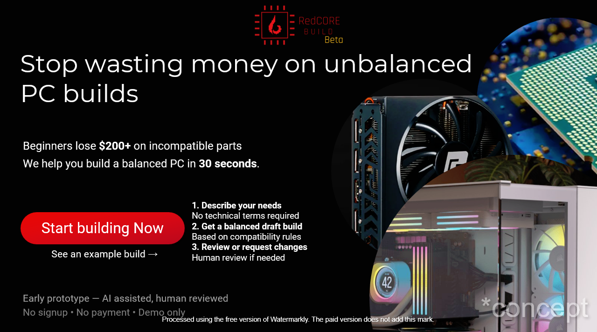
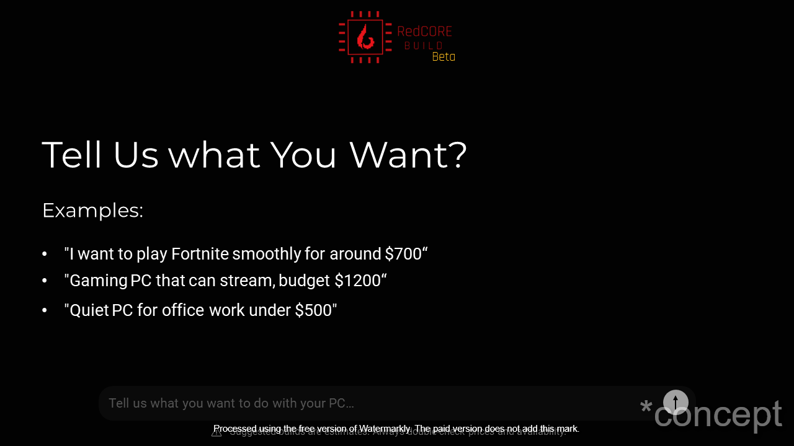
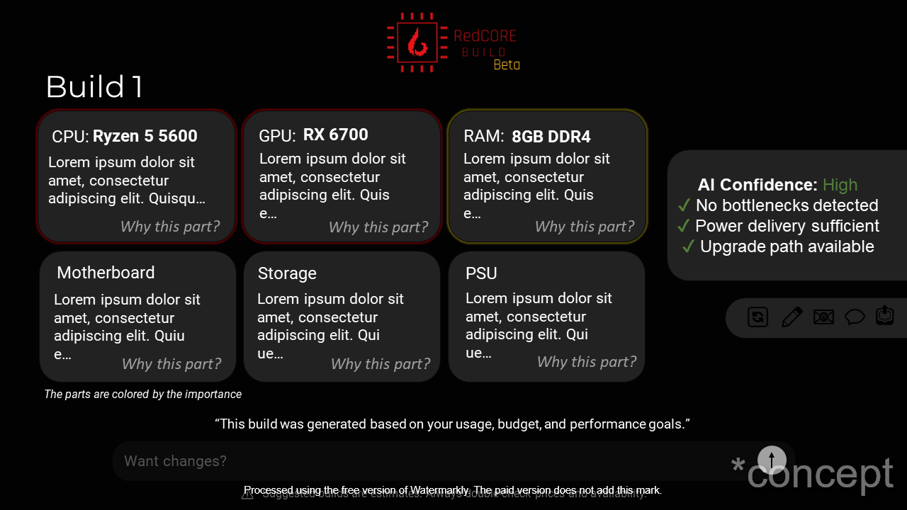
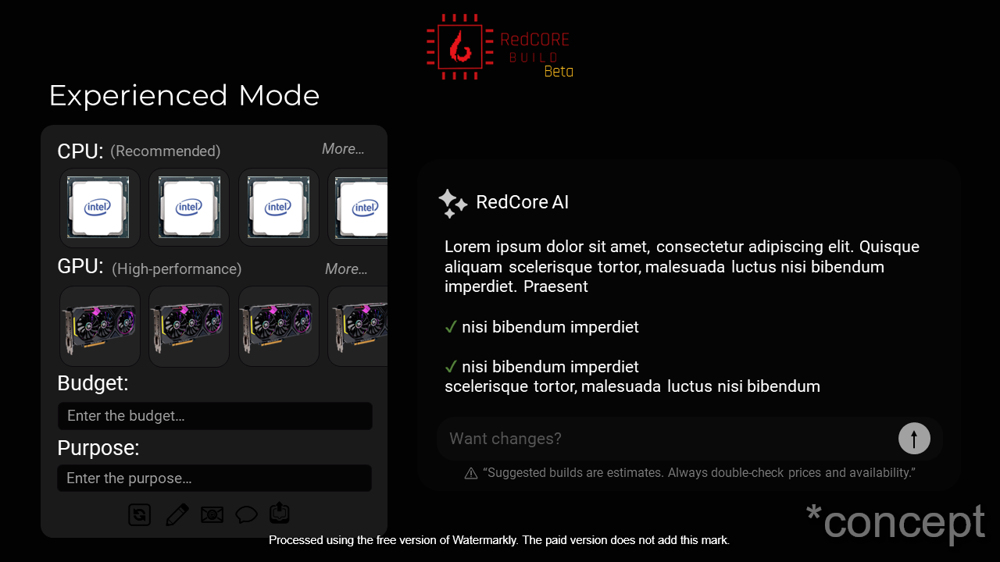
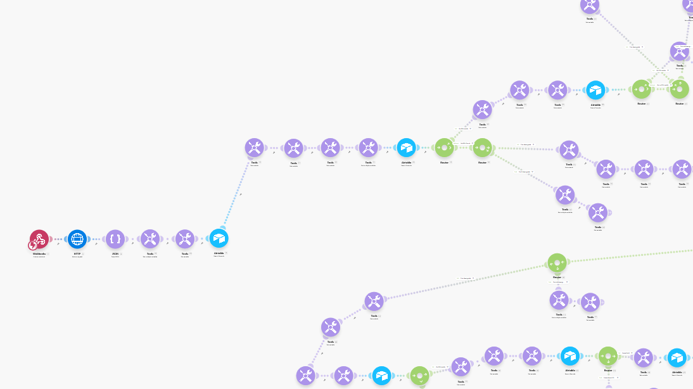

# RedCore AI PC Builder

RedCore is a student-built web tool that helps beginners generate a compatible desktop PC build using normal language.

Example input:
> "I want a gaming PC around $800 for school and esports."

The system:
1. Uses an AI model to understand the request (budget, purpose, tier)
2. Applies real PC-building rules (budget allocation + compatibility constraints)
3. Selects appropriate hardware parts from a database
4. Returns a complete build result

**Important:** AI does NOT choose parts randomly.  
AI only extracts structured intent - the backend rule engine makes the hardware decisions.

---

## Demo Video

▶ Watch the demo: https://www.youtube.com/watch?v=nRa5SJxBWAM

## Design Concept

<table>
<tr>
<td></td>
<td></td>
</tr>
<tr>
<td></td>
<td></td>
</tr>
</table>

## System Workflow

---

## Modes

### Beginner Mode (main)
A user types what they want in a single text box, and the system generates a full build automatically.

### Experienced Mode (power user)
For users who already know some parts:
- the user selects key components (ex: CPU and/or GPU) or sets constraints
- the system auto-completes the rest of the build with compatible parts

---

## Build Result Output (Export)
After generation, the final build is **exported and shown on a results page** as a structured list/cards, for example:
- CPU
- GPU
- Motherboard
- RAM
- Storage
- PSU
- Case  
Plus short explanations about why each part was chosen and any compromises.

---

## Architecture

Frontend: Framer (UI + pages)  
Backend: Cloudflare Worker (API / rule engine)  
AI: HuggingFace (Qwen2.5) for extraction only  
Database: Local JSON hardware database (exported from Airtable)

Flow:
User → Framer Input → Worker API → AI extraction → rule engine → JSON database → Final Build JSON → Results Page

---

## Current Progress
✅ Framer UI is ~50% designed  
✅ Worker API running  
✅ AI extraction working (budget/purpose/tier)  
✅ JSON database migration completed (Airtable → JSON)  
✅ GPU selection engine implemented with downgrade safety  
✅ CPU selection engine implemented using GPU requirements + budget

---

## Next Steps
- Add RAM selection rules (capacity + DDR type)
- Motherboard selection (socket + RAM type match)
- PSU selection (wattage + connectors)
- Storage selection
- Final formatting + better explanations on the results page
- Later: 3D PC preview

---

## Goal
Reduce the fear beginners have when choosing PC parts and simulate how a real technician plans a build.

Work in progress - feedback is welcome.# RedCore AI PC Builder

RedCore is a student-built web tool that helps beginners design a desktop PC using normal language.

Example input:

> "I want a gaming PC around $800 for school and esports."

The system:

1. Uses an AI model to understand the request
2. Applies real PC building rules (budget allocation and compatibility)
3. Selects appropriate hardware parts
4. Returns a complete PC build

The AI does not pick random components.
It only interprets the user’s intent — all hardware decisions are made by a rule-based configuration engine in the backend.

---

## Demo Video

https://www.youtube.com/watch?v=nRa5SJxBWAM

---

## How It Works

Frontend → Framer UI
Backend → Cloudflare Worker API
AI → HuggingFace (Qwen2.5)
Database → Local JSON hardware database (for V1)

Flow:
User text → AI extraction → rule engine → component selection → final build JSON

---

## Current Features

* Natural language PC request input
* AI extraction (budget, purpose, performance tier)
* GPU selection engine with budget allocation
* CPU matching based on GPU requirements
* Automatic downgrade safety if the budget is too low

---

## Planned Features

* RAM, motherboard, PSU and storage selection
* Conversational build editing
* Improved results page UI
* 3D PC preview

---

## Goal

The goal is to remove the fear beginners have when choosing PC parts and simulate how a real technician plans a computer build.

This is a learning project and work in progress.
