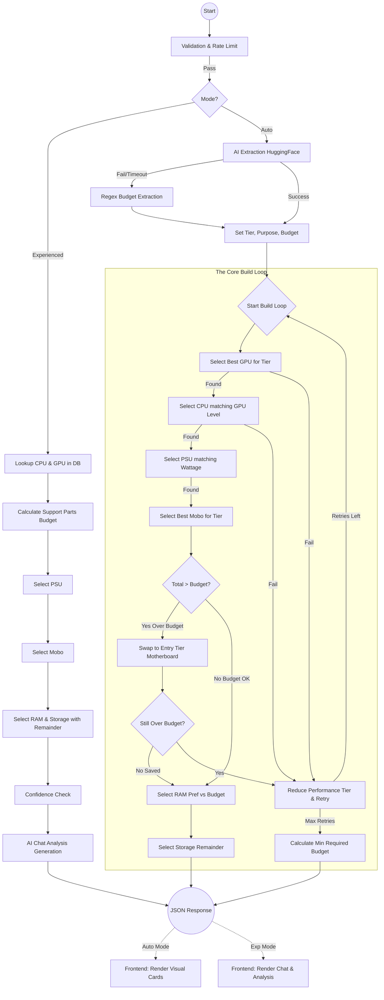
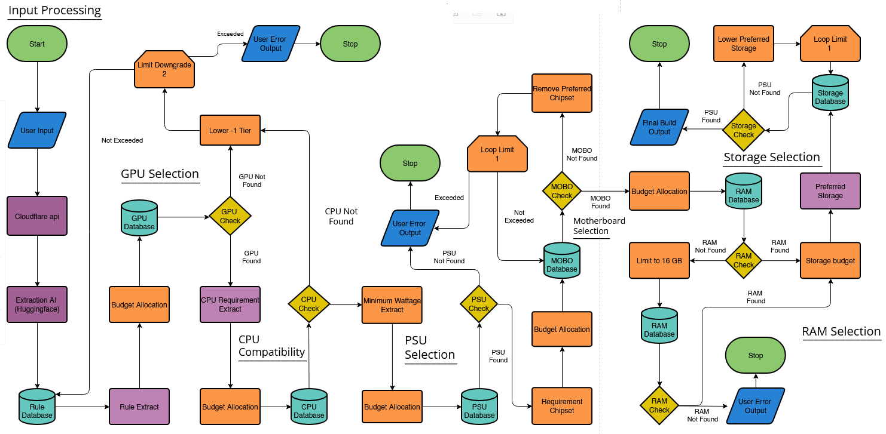

# Purpose of the Algorithm

The purpose of the RedCore algorithm is to automatically generate a compatible desktop PC build based on a user's request. Many beginners struggle with selecting PC parts because hardware compatibility, performance balance, and budget allocation require technical knowledge.

The algorithm solves this problem by converting a natural-language request into a structured system decision process. The system analyzes the user's requirements, including budget, intended use, and performance tier, and then applies rule-based logic to select hardware components that satisfy compatibility constraints and budget limitations.

Instead of allowing the AI to directly choose parts, the AI is only used to extract structured data from the user's request. The actual hardware decisions are performed by the rule engine using predefined compatibility rules and hardware databases.

This design ensures that the final build is consistent, realistic, and technically valid while still allowing the user to interact with the system using simple natural-language input. A key feature of the updated algorithm is its Intelligent Cost Saving and Recommendation Engine, which attempts to preserve performance by swapping non-critical parts and provides helpful suggestions when a user's budget is insufficient.

## Algorithm Explanation

The user types what they want in the Framer frontend. The request is then sent to a webhook hosted on Cloudflare Workers. When the Cloudflare Worker receives the request, it first passes through a Validation and Security Layer. This layer sanitizes all inputs to prevent malicious code and applies rate limiting to protect the system from abuse.

Once validated, the user's text input is forwarded to the AI model Qwen 2.5 hosted on HuggingFace.

The AI receives a special prompt designed to extract only three structured values from the user's request: the budget, the purpose of the build, and the performance tier (Entry, Mid, High). The AI does not select hardware parts. Its only task is to convert the natural-language request into structured data.

The extracted data is returned as JSON. Example format:

>{
"budget_usd": "",
"purpose": "",
"performance_tier": ""
}

**Below is the prompt used for the extraction process:**

```
Extract only these three values from the user input.

Rules:
* budget_usd: number only (USD). If missing, estimate reasonably.
* purpose: must be exactly one of these values:
  Gaming
  Competitive Gaming
  Content Creation
  Streaming
  Office/School
* performance_tier: one of (Entry, Mid, High).

Mapping guidance:

* esports, fps, competitive, valorant, cs2 → Competitive Gaming
* gaming → Gaming
* video editing, rendering, blender, premiere, design → Content Creation
* streaming, twitch, broadcasting → Streaming
* homework, school, office, browsing, microsoft office → Office/School

If the user's request matches multiple purposes, choose the dominant one.

Return ONLY valid JSON in this format:
{
"budget_usd": "",
"purpose": "",
"performance_tier": ""
}
```
Before the selection process begins, the system defines internal variables for performance tiers:

**Entry = 1
Mid = 2
High = 3**

These numeric values allow the system to perform calculations and tier adjustments.

After the AI returns the extracted JSON, the purpose value is compared with entries inside the Purpose Database. This database contains rules such as tier adjustments and component budget percentages. For example, a purpose like Gaming may increase GPU priority, while Office/School may reduce GPU tier expectations.

The system then enters the Core Build Loop, which uses a Waterfall Allocation Method. Instead of pre-allocating a fixed budget for every component, this method prioritizes critical parts and uses the remaining funds for support components.

**Phase 1: Critical Component Selection**

The system first calculates a budget for the primary performance components using percentages defined in the purpose configuration table.

1. **GPU Selection:** The GPU is treated as the primary component. The system calculates a GPU budget and searches the database for a suitable GPU matching the target tier. If no GPU is found, the system downgrades the target tier by one level and retries the search. A downgrade limit of two attempts is implemented to prevent infinite loops.

2. **CPU Selection:** After a GPU is selected, the system reads its CPU_req parameter, which represents the minimum CPU performance required for system balance. It then searches the CPU database using the calculated CPU budget and the required CPU level. If no suitable CPU is found, the system triggers the same downgrade logic as the GPU selection.

3. **PSU Selection:** The algorithm extracts the minimum wattage requirement from the selected GPU's data. It searches for a PSU that meets or exceeds this wattage and fits the PSU budget. Unlike GPU or CPU selection, this stage does not allow downgrading; if a suitable PSU is not found, the entire build attempt for that tier fails, triggering a system downgrade.

**Phase 2: Support Component Selection & Optimization**

After the three core components are chosen, the system calculates the Remaining Budget by subtracting their cost from the user's total budget.

4. Motherboard Selection and Optimization: This is a key optimization step.
   - The system first searches for a motherboard that matches the CPU's socket, the target performance tier, and the remaining budget.
   - After selecting all four parts (GPU, CPU, PSU, Mobo), it performs a budget check. If the running total exceeds the user's budget, the algorithm does not immediately fail.
   - Instead, it activates a cost-saving measure: it attempts to swap the selected motherboard for a compatible "Entry" tier model. If this swap brings the total cost back within budget, the build is saved with its high-performance CPU/GPU intact, and the algorithm proceeds.
    - If the build is still over budget even with the cheapest compatible motherboard, then the motherboard swap is considered a failure, and a full system downgrade is triggered.

5. RAM Selection: The system uses the final remaining budget to select RAM. It first attempts to purchase the "Preferred" RAM capacity defined in the purpose rules (e.g., 32GB for Content Creation). If the remaining budget is insufficient, it automatically falls back to a lower-capacity but more affordable option (e.g., 16GB) to ensure a complete build is generated.

6. Storage Selection: Finally, whatever funds are left after RAM selection are used to purchase the best possible storage drive. The system prioritizes higher-tier storage but will select a lower-tier drive if necessary to fit the last of the budget.

**Failure Handling and Output**

If the downgrade loop completes and no build can be found within the budget, the algorithm does not simply stop. It activates the Recommendation Engine, which calculates the absolute minimum budget required to fulfill the user's request. This value is returned as a helpful suggestion (e.g., "A build for this purpose requires at least $650").

Once a complete build is successfully selected, the system generates the final output. The format of this output depends on the user's mode:

  - **Auto Mode:** The system returns a structured JSON object containing the list of parts. The frontend uses this data to render a series of Visual Component Cards.
  - **Experienced Mode:** The system runs a final Confidence Report to check for bottlenecks and upgrade paths. This data, along with the build list, is sent to the AI, which generates a detailed Textual Analysis of the build's strengths and weaknesses.

## Algorithm Workflow Diagrams

The following diagram illustrates the complete, updated rule engine workflow, including the motherboard swap logic and the different output paths.



### Old Algorithm Flow



### Early Algorithm Design


Once all components are successfully selected, the algorithm exports the complete build configuration including component names, specifications, and descriptions. The result is sent back to the webhook, which forwards the response to the Framer frontend where the final build is displayed to the user.

