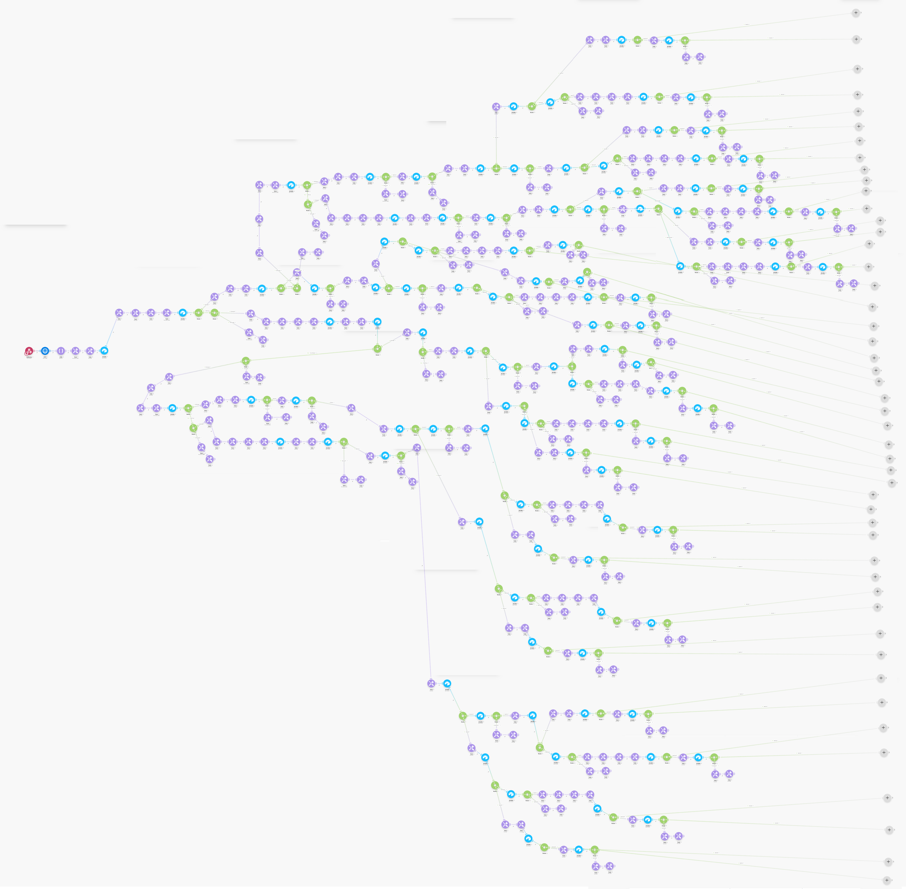

# RedCore AI PC Builder
## Development Log

This document describes the development process of the RedCore AI PC Builder project, including the main phases, tools used, challenges encountered, and solutions implemented during development.

### Phase 1 — Concept Planning

**~4 days × ~2.5h ≈ 10 hours**

#### Work:
The project started with defining the concept of an AI-assisted PC builder that could help beginners generate compatible hardware builds based on natural language input.

The main problem identified was that many beginners struggle to choose compatible PC parts and understand how hardware components interact.

Planned the system concept:

- AI understands the user request
- A rule engine selects compatible parts
- A hardware database provides available components

Designed the first workflow sketches and system logic diagrams.
Created early notes describing how the AI extraction and rule engine would interact.

#### Tools:
- Canva (concept visuals)
- GIMP (image editing)
- Visual Paradigm (workflow diagrams)
- ChatGPT (brainstorming and idea exploration)

#### Outcome:
By the end of this phase, the core system architecture and project direction were clearly defined. The main system components (AI extraction, rule engine, hardware database, and frontend interface) were established, providing a foundation for the following development phases.

### Phase 2 — Hardware Database Creation
**~5 days × ~3.5h ≈ 17–18 hours**

#### Work:
During this phase, the hardware database for the RedCore system was created using Airtable.
Separate tables were created for each component category:
- GPU
- CPU
- RAM
- PSU
- Motherboard
- Storage

Each table contained specifications necessary for compatibility checks and rule-based selection, such as price, performance tier, socket type, memory type, and power requirements.
For the beta version of the project, approximately 9 components were added to each table to create a small but functional dataset for testing the system logic.

#### Tools:
- Airtable (database creation and data organization)
- ChatGPT (brainstorming database structure and fields)

**Note:**
Most of the component data was entered manually, which made the process slow but allowed careful control over the database structure.

#### Outcome:
By the end of this phase, a structured hardware database was established. The component tables and specifications provided the foundation for the rule engine to perform compatibility checks and select appropriate parts for generated PC builds.

### Phase 3 — Automation Prototype
**~2 weeks (≈7 workdays) × 4h ≈ 28 hours**

#### Work:
We built a working prototype of the AI PC Builder using a no-code automation system in Make.com.

The prototype connected user input with the hardware database and AI extraction. HuggingFace was used as the AI extractor to analyze the user request, while Airtable provided the hardware database used by the automation rules.

The automation scenario handled the logic for selecting compatible parts and generating a basic PC build result.

The following diagram shows the full Make.com automation scenario used during the early prototype stage.
As the system expanded, the automation grew to more than 500 modules, which eventually caused performance issues and motivated the migration to a coded backend.

*Figure: Full Make.com automation scenario used during the prototype phase.  
The workflow contains more than 500 modules handling rule-based hardware selection.*

The scenario eventually exceeded 500 modules and became difficult to maintain and scale within the free Make.com limits.

#### Tools:
- Make.com (automation system and algorithm prototype)
- Airtable (hardware database)
- HuggingFace (AI extraction model)
- ChatGPT (brainstorming and development suggestions)

#### Challenge:
As the system grew, the automation scenario became very large (500+ components). This started causing performance issues and lag inside Make.com. In addition, the free usage limits and credit restrictions made it difficult to continue scaling the automation system.

#### Solution:
Because of these limitations, we decided to migrate the system from Make.com to a custom coded backend implementation.

### Phase 4 — Backend Migration
**~3 days × ~3.5h ≈ 10–11 hours**

#### Work:
After the limitations of the Make.com automation system, we decided to migrate the backend logic to a Cloudflare Worker API. This approach allowed the system to handle more requests and provided a scalable backend while still remaining suitable for the free tier during the beta stage.

The automation logic that was previously implemented in Make.com was gradually translated into code. The hardware database was exported from Airtable and converted into JSON files so that it could be used directly by the backend.

#### Tools:
- VS Code (coding environment)
- HuggingFace API (AI extraction model)
- ChatGPT (code implementation help and suggestions)
- Postman (API testing)

#### Challenge:
I did not have prior experience with the JavaScript language, which made implementing the backend logic more difficult.

#### Solution:
To overcome this, I used ChatGPT as a learning and development assistant to help translate the existing automation logic into working Cloudflare Worker code and to understand how the API structure should be implemented.

#### Outcome:
By the end of this phase, the Make.com automation prototype was successfully replaced by a Cloudflare Worker backend using a JSON hardware database, allowing the system to run as a coded API instead of a no-code automation scenario.

### Phase 5 — AI Integration and Rule Engine Development
**~4–5 days × ~3.5h ≈ 14–18 hours**

#### Work:
During this phase the AI extraction system and the rule engine logic were implemented together. 
The HuggingFace model was used to extract structured information from the user's natural language request, such as budget, purpose, and performance tier.

Based on the extracted information, the rule engine processed the hardware database and selected compatible components using predefined rules such as budget allocation and compatibility checks.

#### Tools:
- HuggingFace API (AI extraction)
- VS Code (development)
- ChatGPT (implementation assistance and debugging)

#### Outcome:
By the end of this phase, the system could accept a user request, extract structured values using AI, and generate a compatible hardware build using the rule engine and hardware database.

### Phase 6 — UI Design in Framer
**~2 weeks (8 days) × 4h ≈ 32 hours**

#### Work:
During this phase we worked on designing the frontend interface of the project. We tested several website builders and eventually chose Framer because its workspace and design tools felt similar to Figma and were easy to work with for prototyping.

The first UI layouts were designed in PowerPoint to plan the page structure and elements. After that, the designs were recreated and implemented inside Framer to build the actual webpage prototype.

#### Tools:
- Framer (frontend website builder)
- PowerPoint (initial UI layout design)
- YouTube (learning Framer and UI design basics)

#### Challenge:
Since we had not used Figma or similar website design tools for a long time, we struggled at first to understand how Framer's layout system and components worked.

#### Solution:
To overcome this, we watched YouTube tutorials to learn the basics of Framer and experimented with templates and example projects. This helped us understand the workflow faster and recreate our planned UI design.

### Phase 7 — Video Recording & Editing
**~1 week × ~3.5h ≈ 24–25 hours**

#### Work:
During this phase we created promotional and demonstration videos to present the RedCore AI PC Builder concept online.

A main demo video explaining how the system works was produced and published on YouTube. In addition, 17 short-form videos were created to test different formats and attract attention to the project. These videos were uploaded to YouTube Shorts, TikTok, and Instagram.

The performance of the videos varied. Some short videos reached around 1k–2k views, while others received very little engagement. This experimentation helped test different content formats and understand how the project could be presented online.

#### Tools:
- Adobe Premiere (video editing)
- Adobe Animate (UI animation for demonstrations)
- PowerPoint (UI visual design for the demo)

#### Challenge:
Promoting the videos and reaching an audience was difficult. Some platforms did not recommend the videos widely, and engagement varied significantly between uploads.

#### Solution:
Despite the inconsistent results, multiple short videos were produced and published across several platforms to experiment with different formats and improve the visibility of the project.

### Phase 8 — Documentation
**~5 days × ~3.5h ≈ 17–18 hours**

#### Work:
During this phase we focused on documenting the entire project and organizing all the resources into a structured archive. The goal was to make the idea and system easier to understand for both developers and users.

This included writing the README, creating development logs, organizing design assets, system diagrams, evidence screenshots, and media files into clear folders.

#### Challenge:
Because we did not log every step during development, collecting the files and reconstructing the timeline was sometimes difficult.

#### Solution:
To solve this, we reviewed all available materials and brainstormed the development process step by step to reconstruct the timeline and complete the documentation.

#### Outcome:
By the end of this phase, the project documentation was completed, and all resources were organized into a structured archive, making the project easier to understand, review, and present.

- **Phase 1 — Concept Planning (~10h)**
- **Phase 2 — Hardware Database Creation (~17–18h)**
- **Phase 3 — Automation Prototype (~28h)**
- **Phase 4 — Backend Migration (~10–11h)**
- **Phase 5 — AI Integration & Rule Engine (~14–18h)**
- **Phase 6 — UI Design in Framer (~32h)**
- **Phase 7 — Demo Video Recording & Editing (~24–25h)**
- **Phase 8 — Documentation & Project Organization (~17–18h)**

**≈ 135–145 hours**

### Development Summary

The RedCore AI PC Builder project was developed across multiple phases including concept design, database creation, automation prototyping, backend implementation, AI integration, frontend design, media production, and documentation.

The project evolved from an initial no-code prototype built in Make.com into a custom backend system implemented using Cloudflare Workers and a JSON hardware database. The final system integrates AI-based input extraction with a rule-based hardware selection engine to generate compatible PC builds from natural language requests.

Total estimated development time: **approximately 135–145 hours.**

