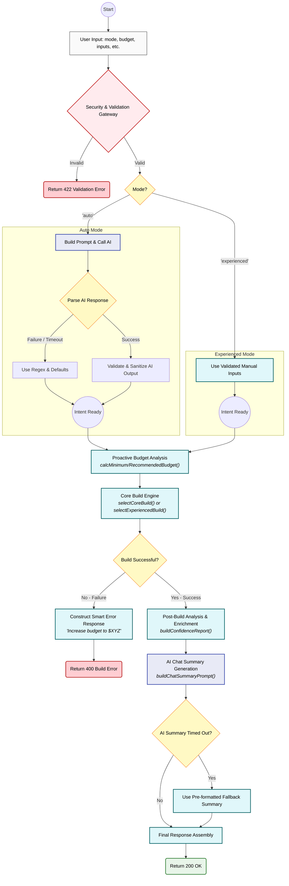

# 
System Architecture 

## System Overview

The system starts when the user enters a request for a PC build or selects specific components via the frontend. The request is sent securely to the Cloudflare Worker API.

When the API receives the request, it first performs security validations, including input sanitization and rate limiting. Depending on the user's selected mode ("Auto" or "Experienced"), the system either manually locks in specific parts or forwards the input to the HuggingFace AI model to extract structured data (budget, purpose, and performance tier).

After the data preparation step, the parameters are passed to the Core Build Engine. This engine works with an extended JSON hardware database containing CPUs, GPUs, motherboards, RAM, storage, and power supplies.

The engine uses a "waterfall" budget allocation method. It prioritizes critical performance components (GPU and CPU) and allocates the remaining budget to support components (RAM and Storage). It also includes a recommendation engine that calculates a "minimum required budget" if the user's requested budget is too low.

Finally, the selected components and a system confidence report are sent back to the AI model in "Experienced Mode" to generate a natural-language explanation. The result is sent back through the API and rendered on the user interface, with a different presentation for each mode.

## Architecture Diagram

The overall architecture of the system is shown in the diagram below.
The diagram illustrates the system's branching logic for "Auto" and "Experienced" modes, its internal fallback loops, and the dual use of the AI for both input extraction and output generation.

*Figure: High-level system architecture of the RedCore AI PC Builder.*

## System Components

The system is divided into several components.

1. Frontend
The frontend is built using Framer. It provides the user interface where the user enters requirements or utilizes "Experienced Mode". In Auto Mode, it renders the final build as a series of visual Component Cards. In Experienced Mode, it displays a detailed AI-generated text analysis.

2. Cloudflare Worker API
The API acts as the central controller. It receives requests from the frontend, handles security, validation, rate limiting, and orchestrates the complex data flow between the AI model, the rule engine, and the databases.

3. AI Extraction & Generation (HuggingFace)
The AI model is utilized for two distinct tasks. In "Auto Mode," it is used for Input Analysis to extract structured parameters like budget, purpose, and performance tier. In "Experienced Mode," it is used for Output Generation to synthesize a human-readable explanation and compatibility analysis of the final build.

4. Rule Engine
The rule engine processes the extracted parameters and applies sophisticated hardware selection logic. It uses a "Waterfall" allocation algorithm and contains specific fallback mechanisms, such as swapping the motherboard to a cheaper tier to preserve core performance components.

5. Hardware Database
The hardware database is stored as JSON files. It contains information about available components such as CPUs, GPUs, motherboards, RAM, storage devices, and power supplies, including compatibility data and pricing.

6. Confidence & Recommandation System
This subsystem analyzes the final build for potential issues like CPU bottlenecks, insufficient power headroom, and future upgradeability. It also includes the logic to calculate a "minimum required budget" if the user's initial request is not feasible.

7. Output Renderer
The final PC build is returned to the frontend and displayed to the user through the interface.

## Data Flow
The data flow of the system follows these steps:

- The user submits a request via the frontend interface.
- The request is sent to the Cloudflare Worker API, which validates and sanitizes the input.
- If in Auto Mode: The API sends the text input to the HuggingFace AI model to extract structured values.
- If in Experienced Mode: The system locks in the user's chosen CPU/GPU.
- The Rule Engine processes these parameters, starting the Core Build Loop. It first selects the GPU, CPU, and PSU.
- It then selects a motherboard. If the total cost exceeds the budget, it attempts to swap the motherboard to an "Entry" tier model to save costs.
- If the build is still over budget, a full system tier downgrade is triggered, and the loop restarts.
- The engine uses the remaining budget to select RAM and Storage.
- If no build can be generated, the Recommendation Engine calculates a suggested minimum budget.
- The final PC build configuration is generated. In Experienced Mode, this data is sent back to the AI for analysis.
- The result is returned to the frontend and displayed to the user as either visual cards (Auto Mode) or chat text (Experienced Mode).

## Technologies Used

- Frontend: Framer
- Backend API: Cloudflare Workers
- AI Extraction: HuggingFace (Qwen model)
- Rule Engine: Custom TypeScript "Waterfall" logic with intelligent fallbacks
- Database: JSON hardware database

## Design Principle

The AI model is used for intent extraction and natural language synthesis, not for hardware selection logic.
All hardware decisions are made by the deterministic Rule Engine, which ensures predictable, compatible, and technically valid results. This hybrid approach leverages the AI for its language capabilities while relying on hard-coded rules for the critical task of component selection, avoiding random or inconsistent AI-generated hardware choices.

