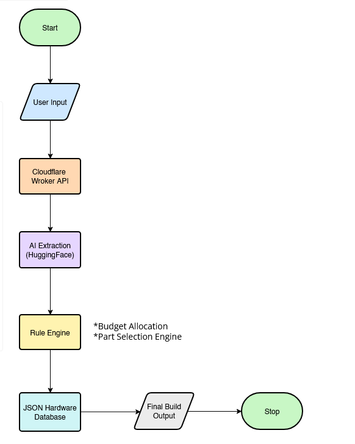

# 
System Architecture 

## System Overview

The system starts when the user types what they want for a PC build. The request is sent from the frontend to the Cloudflare Worker API.

When the API receives the request, it forwards the input to the HuggingFace AI model. A special prompt is used to extract structured information from the user text. The AI extracts the budget, purpose, and performance tier from the request.

After the extraction step, the structured data is passed to the Rule Engine. The rule engine works with an extended JSON hardware database that contains lists of available parts such as CPUs, GPUs, motherboards, RAM, storage, and power supplies.

The rule engine calculates how the budget should be distributed across components and determines the appropriate performance tier. It then selects the most suitable hardware parts from the database while following compatibility and budget constraints.

Finally, the selected components are returned as a complete PC build configuration. The result is sent back through the API and rendered on the user interface, where the user can see the generated build.

## Architecture Diagram

The overall architecture of the system is shown in the diagram below.
The system follows a sequential processing pipeline from user input to final build generation.

This diagram shows how the main components of the system communicate with each other.

*Figure: High-level system architecture of the RedCore AI PC Builder.*

## System Components

The system is divided into several components.

1. Frontend
The frontend is built using Framer. It provides the user interface where the user enters the PC requirements and receives the generated build result.

2. Cloudflare Worker API
The API receives the request from the frontend and handles communication between the frontend, the AI model, and the rule engine.

3. AI Extraction (HuggingFace)
The AI model is used to analyze the user's text input. A prompt is used to extract structured parameters such as budget, purpose, and performance tier.

4. Rule Engine
The rule engine processes the extracted parameters and applies hardware selection logic. It determines how the budget should be allocated and selects compatible parts.

5. Hardware Database
The hardware database is stored as JSON files. It contains information about available components such as CPUs, GPUs, motherboards, RAM, storage devices, and power supplies.

6. Output Renderer
The final PC build is returned to the frontend and displayed to the user through the interface.

## Data Flow

- The data flow of the system follows these steps:
- The user types a PC request on the frontend interface.
- The request is sent to the Cloudflare Worker API.
- The API sends the text input to the HuggingFace AI model.
- The AI extracts structured values such as budget, purpose, and performance tier.
- The rule engine processes these values and calculates component budgets.
- Hardware components are selected from the JSON hardware database.
- The final PC build configuration is generated.
- The result is returned to the frontend and displayed to the user.

## Technologies Used

- Frontend: Framer
- Backend API: Cloudflare Workers
- AI Extraction: HuggingFace (Qwen model)
- Rule Engine: custom rule-based selection system
- Database: JSON hardware database

## Design Principle

The AI model is used only to extract user intent, not to select hardware components.
All hardware decisions are made by the rule engine, which ensures predictable results and avoids random AI-generated hardware choices.

